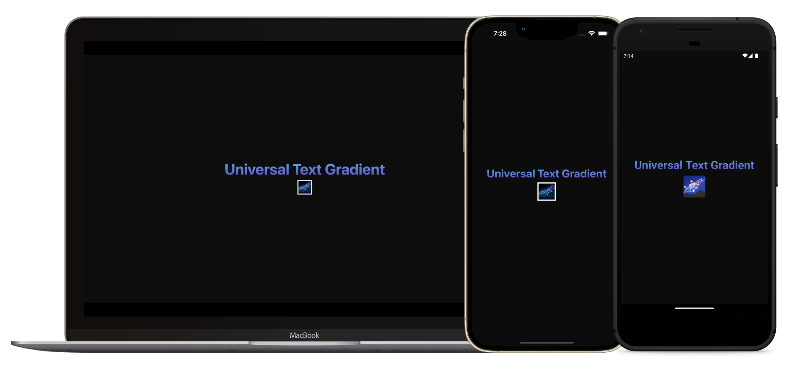

# Universal Gradient Text 🌌

### Simplest way to add gradient texts to universal React Native Projects



A universal text component with a gradient overlay that works on web and mobile. Under the hood, the library has dependencies on `expo-linear-gradient` & `@react-native-masked-view/masked-view`. As a result, you will need Expo Modules to be setup for bare RN projects. On web, gradient texts are done with CSS.

### Installation

```
yarn add universal-gradient-text
```

#### Expo

In Expo apps, you will also need to add the following dependencies:

```
npx expo install expo-linear-gradient @react-native-masked-view/masked-view
```

#### NextJS

On Next, you will need to follow extra steps to transpile the library. Update your `next.config.js`:

```
...
transpilePackages: [
  ...
  'universal-gradient-text',
],
...
```

### Usage

For instructions on how to use the library, see the [docs website](https://universal-gradient-text.vercel.app/).
