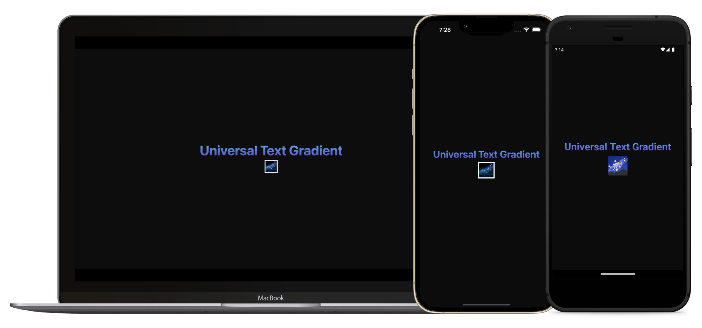

# Universal Text Gradient 🌌

### Simplest way to add text gradients to universal React Native Projects



A universal text component with a gradient overlay that works on web and mobile. Under the hood, the library has dependencies on `expo-linear-gradient` & `@react-native-masked-view/masked-view`. As a result, you will need Expo Modules to be setup for bare RN projects. On web, text gradients are done with CSS.

### Installation

```
yarn add universal-text-gradient
```

### Usage

For instructions on how to use the library, see the [docs website](https://universal-text-gradient.vercel.app/).
